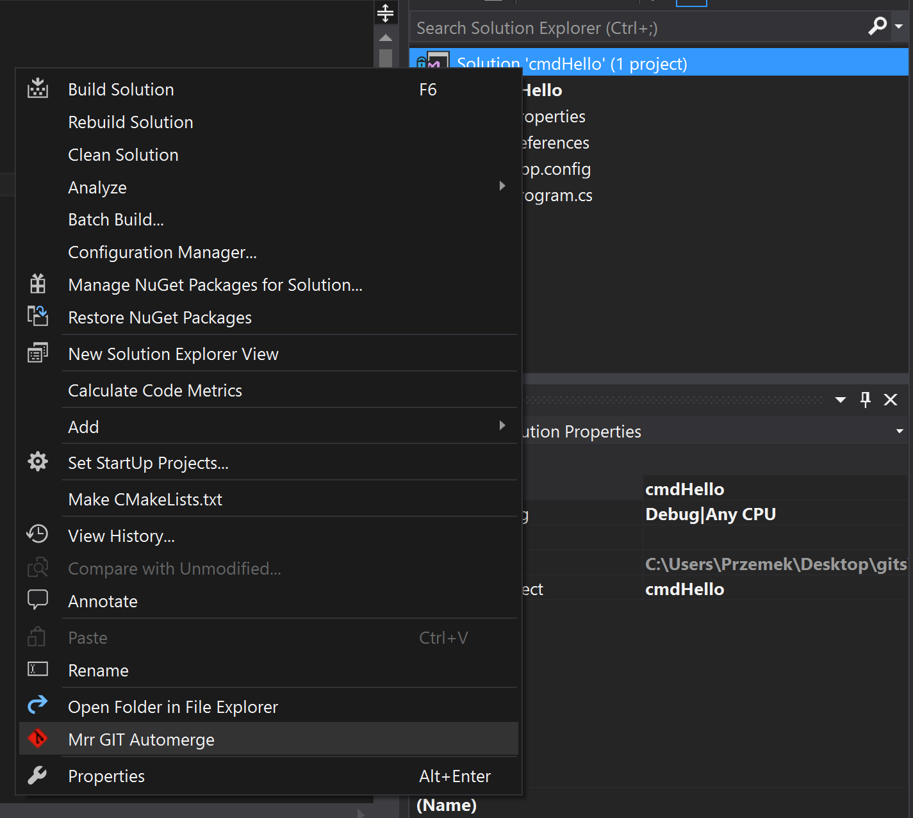
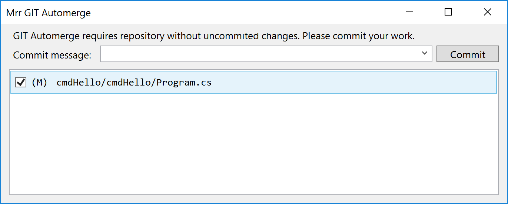
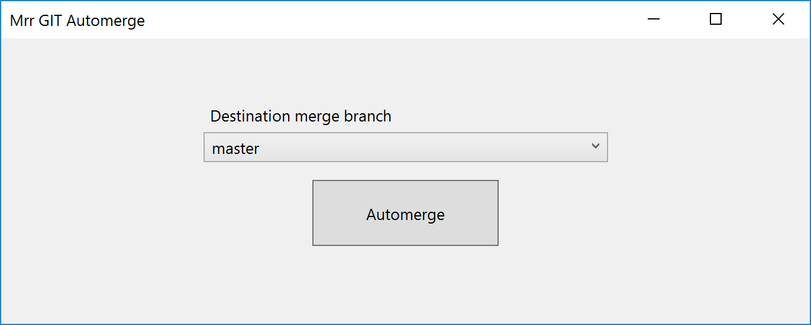
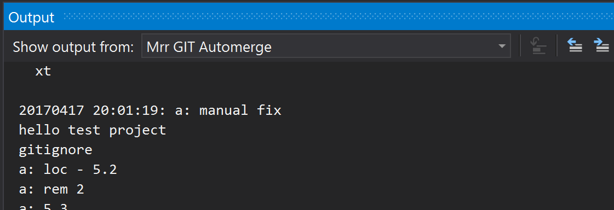

# Mrr GIT Automerge
Simplyfies merging with GIT to bare minimum.

## Requirements
Application `git.exe` must be accesible in PATH. Extension assumes it can be run without specifying full path.

## Visual Studio Extension
Extension is available to download at this location: [Mrr GIT Automerge at Visual Studio Marketplace](https://marketplace.visualstudio.com/vsgallery/3d16624f-8bc4-4c36-a508-f70f8285aea7)

## Usage
To use extension right-click on solution or project node i Solution Explorer. Click "Mrr GIT Automerge" menu item.

If there are uncommited changes in GIT repository you will be prompted to commit first. The commit message text box lists up to 10 last commit messages for convenience.

Then and only then automerge option will be available.

Automerging may take a little time but all logs will be displayed in main window. In case it fails to automerge - unresolvable git auto-merge user will be able to see why merging failed without opening tool's output window.

## Any problems?
In case of any unpredictable behavior logs are shown in plugin's output window called "Mrr GIT Automerge".

